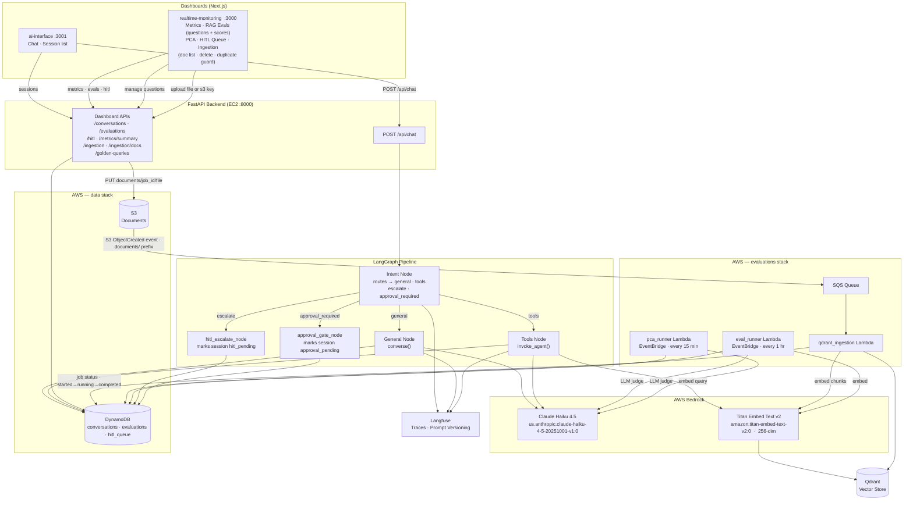

# LLMOps — End-to-End RAG Application

[](LICENSE)
[](https://www.python.org/downloads/)
[](https://github.com/gokulnathan66/llmops/actions/workflows/ci.yml)
[](CONTRIBUTING.md)

A production-grade LangGraph RAG API with full LLMOps tooling: observability, prompt versioning, evaluation pipelines, HITL, real-time monitoring, and one-command infrastructure.

---

## Architecture Overview

> See [`llmops-architecture.drawio`](llmops-architecture.drawio) for the full end-to-end architecture diagram (open with [draw.io](https://app.diagrams.net/)).



### Stack

| Layer | Technology |
|---|---|
| API | FastAPI + LangGraph |
| LLM | AWS Bedrock (Claude Haiku 4.5 — `us.anthropic.claude-haiku-4-5-20251001-v1:0`) |
| Vector store | Qdrant |
| Embeddings | AWS Bedrock Titan Embed Text v2 (256-dim) · retry with exponential backoff |
| Observability | Langfuse (traces + prompt versioning) |
| Data store | DynamoDB (conversations, evaluations, HITL) |
| Document storage | S3 |
| Ingestion | Upload → S3 (`documents/{job_id}/`) → SQS → Lambda → Qdrant · job status in DynamoDB |
| RAG Evaluation | `eval_runner` Lambda — EventBridge hourly, stale session detection → cosine sim + LLM judge → auto-HITL |
| PCA | `pca_runner` Lambda — EventBridge every 15 min, post-conversation topic/sentiment/unresolved analysis |
| HITL | Two modes: **escalation** (bot can't answer → human takes over mid-conversation) and **approval gate** (sensitive action requires supervisor sign-off before proceeding) |
| Infrastructure | Terraform (5 independent stacks), Docker, ECR, EC2 |

---

## Project Structure

```
llmops/
├── src/                                    # API + LangGraph application
│   ├── main.py                             # FastAPI app entry point
│   ├── api/
│   │   ├── routes.py                       # POST /api/chat endpoint
│   │   └── dashboard.py                    # Dashboard, HITL, ingestion, golden query endpoints
│   ├── graph/
│   │   └── builder.py                      # LangGraph state machine (5 nodes)
│   ├── nodes/
│   │   ├── intent.py                       # Intent router → "general" | "tools" | "escalate" | "approval_required"
│   │   ├── general.py                      # Direct LLM response node · writes cost record per turn
│   │   ├── tools.py                        # RAG agent node (LangChain + Qdrant) · writes cost record per turn
│   │   ├── hitl_escalate.py                # Escalation node: marks session hitl_pending · creates HITL queue item
│   │   └── approval_gate.py                # Approval node: marks session approval_pending · creates approval HITL item
│   ├── services/
│   │   ├── bedrock.py                      # Bedrock: converse, structured output, agent
│   │   ├── conversation.py                 # DynamoDB: turns, metadata, HITL queue, human turns, cost records
│   │   ├── embedding.py                    # Titan Embed v2 via Bedrock + retry backoff
│   │   ├── prompt.py                       # Langfuse prompt versioning + fallbacks
│   │   ├── qdrant.py                       # Qdrant: collection, upsert, semantic search, list_documents, delete_by_doc_id
│   │   ├── s3.py                           # S3: PDF + CSV document reader
│   │   └── mcp.py                          # MCP server client
│   ├── tools/
│   │   └── rag.py                          # semantic_document_search LangChain tool
│   ├── schema/
│   │   └── config.py                       # Pydantic request/response models
│   ├── states/
│   │   └── config.py                       # GraphState TypedDict
│   └── setting/
│       └── config.py                       # Pydantic Settings (env-based config)
│
├── evaluations/                            # Evaluation pipeline (Lambda handlers)
│   ├── rag_evaluator.py                    # Loads golden queries → semantic search → cosine sim + LLM judge
│   ├── eval_runner.py                      # Entry point: receives job_id from qdrant_ingestion, runs RAG evals
│   └── pca.py                              # Post-conversation analysis · stale session scan · degradation detection
│
├── data/                                   # Knowledge base + ingestion
│   ├── qdrant_ingestion.py                 # Lambda: SQS (S3 event) → chunk → embed → Qdrant
│   │                                       #   · extracts job_id from key path
│   │                                       #   · URL-decodes S3 keys from SQS events
│   │                                       #   · async-invokes eval_runner on completion
│   ├── csv/
│   │   ├── big_tech_company_profiles.csv
│   │   ├── big_tech_financials_summary.csv
│   │   └── big_tech_segment_revenue.csv
│   └── pdfs/
│       ├── annual_reports/                 # Apple, Google, Microsoft 10-K 2025
│       └── news_articles/                  # AI features, cloud growth, advertising
│
├── dashboard/                              # Next.js frontend applications
│   ├── realtime-monitoring/                # Monitoring + ops dashboard (port 3000)
│   │   └── src/
│   │       ├── app/
│   │       │   ├── page.tsx                # Overview: KPI cards, eval table, PCA strip
│   │       │   ├── evals/page.tsx          # Test questions (editable) + latest RAG/faithfulness/relevance per question
│   │       │   ├── pca/page.tsx            # Degradation alert · sentiment health bar · topics · unresolved questions
│   │       │   ├── hitl/page.tsx           # HITL queue review + human response
│   │       │   └── ingestion/page.tsx      # Document upload + S3 key ingestion + live job status + doc list + delete
│   │       ├── components/
│   │       │   ├── KpiCards.tsx
│   │       │   ├── HitlQueue.tsx
│   │       │   ├── IngestionPanel.tsx      # Upload form + ingested doc list + cascaded delete
│   │       │   ├── NavSidebar.tsx
│   │       │   ├── ThemeProvider.tsx
│   │       │   ├── CopyId.tsx
│   │       │   ├── FilterChips.tsx
│   │       │   └── ScoreBar.tsx
│   │       └── lib/api.ts                  # API client (calls FastAPI backend)
│   └── ai-interface/                       # Chat interface (port 3001)
│       └── src/
│           ├── app/
│           │   └── page.tsx                # Chat interface with session list
│           ├── components/
│           │   ├── ChatThread.tsx
│           │   ├── SessionList.tsx
│           │   ├── NavSidebar.tsx
│           │   └── ThemeProvider.tsx
│           └── lib/api.ts                  # API client (calls FastAPI backend)
│
├── iac/stacks/                             # Infrastructure as Code (5 independent stacks)
│   ├── app/                                # EC2 + ECR + IAM
│   ├── data/                               # DynamoDB tables + S3 documents bucket
│   ├── evaluations/                        # Lambdas + SQS + EventBridge cron schedules
│   │   ├── lambda.tf                       # eval_runner, pca_runner, qdrant_ingestion
│   │   ├── sqs.tf                          # Ingestion queue + S3 event notification
│   │   ├── eventbridge.tf                  # Cron rule: pca_runner every 15 min
│   │   └── variables.tf
│   ├── monitoring/                         # CloudWatch dashboard + alarms
│   └── security/                           # Secrets Manager
│
├── scripts/
│   ├── build_lambda_zip.sh                 # Docker-based Lambda zip (linux/amd64, includes .dist-info)
│   ├── deploy.sh
│   └── local_e2e_test.sh
│
├── Dockerfile
├── docker-compose.yaml                     # Local Qdrant (port 6333)
├── pyproject.toml
├── makefile
├── .env.example
└── README.md
```

---

## Features

### Observability — Langfuse
- Every graph execution is wrapped with `@observe()` — intent, general, and tools nodes all emit traces
- Traces are linked per `session_id` for full conversation replay in the Langfuse UI
- **Tool call tracing**: `tools_node` instantiates a `langfuse.langchain.CallbackHandler` inside the `@observe()` scope — it auto-inherits the current trace context, so each LangChain agent step (LLM call → `semantic_document_search` tool call → LLM call) appears as a child span under `tools_node` in the Langfuse timeline
- Toggled by `ENABLE_LANGFUSE=true`

### Prompt Versioning — Langfuse
Prompts are managed via `src/services/prompt.py`. Three versioned prompts:

| Prompt name | Used by | Purpose |
|---|---|---|
| `rag_assistant` | tools node | Financial analyst persona; instructs tool use and source citation |
| `general_assistant` | general node | Conversational assistant; defers data questions to document search |
| `intent_router` | intent node | Routes queries to `tools` (financial data) or `general` (chat) |

Prompts are fetched from Langfuse at startup (with local fallbacks if Langfuse is unreachable). Edit and version them in the Langfuse UI without redeploying.

### Data Management — DynamoDB
Three tables managed by the `data/` Terraform stack:

| Table | Key schema | Purpose |
|---|---|---|
| `conversations` | `session_id` / `sk` (turn#NNN or metadata) | Every chat turn + session metadata · GSI on `status + last_updated_at` for stale-session queries |
| `evaluations` | `session_id` / `sk` · GSI on `eval_type-created_at` | RAG scores, PCA results, golden queries, cost records, ingestion job tracking — all via shared GSI |
| `hitl_queue` | `pk=HITL` / `sk=timestamp#session_id` | Sessions flagged for human review · GSI on `queue_status` |

The `evaluations` table uses a single-table pattern keyed on `eval_type`:

| `eval_type` | Written by | Contents |
|---|---|---|
| `rag` | `eval_runner` Lambda (hourly) | `rag_score`, `faithfulness`, `relevance`, `re_retrieved`, `hitl_flagged` per session |
| `pca` | `pca_runner` Lambda (every 15 min) | `pca_topics`, `pca_sentiment`, `pca_unresolved` per session |
| `cost` | `tools_node` / `general_node` (per turn) | `input_tokens`, `output_tokens`, `cost_usd` — aggregated daily by metrics summary |
| `ingestion_job` | `qdrant_ingestion` Lambda | `status`, `chunks_indexed`, `files_processed`, timing |

### RAG Pipeline

Ingestion path (upload or re-ingest an existing S3 key):

```
POST /api/ingestion/upload
  └─ Writes job record to DynamoDB { status: started }
  └─ Uploads file to S3: documents/{job_id}/{filename}
       └─ S3 ObjectCreated event (documents/ prefix) → SQS → qdrant_ingestion Lambda
            └─ chunk → embed (Titan Embed v2, 256-dim) → upsert to Qdrant
            └─ DynamoDB: { status: running } → { status: completed / error }

POST /api/ingestion/start  (re-ingest an existing S3 key)
  └─ S3 copy-to-self on documents/{job_id}/... re-fires the SQS event → same Lambda path
```

- `semantic_document_search` performs cosine similarity search at query time via Qdrant
- Job status polled live by the dashboard every 3 s via `GET /api/ingestion/status/{job_id}`

### Evaluation

#### RAG Evaluator (`eval_runner` — every 1 hour)

1. Finds sessions inactive for `INACTIVITY_MINUTES` (default 15) via `status-last_updated_at` GSI
2. Marks each session complete
3. For each RAG-routed turn: computes cosine similarity (query embedding vs retrieved doc embeddings) + LLM-as-judge for faithfulness and relevance via Bedrock structured output
4. If `rag_score < RAG_THRESHOLD` (0.6): re-retrieves with `top_k × RAG_RERANK_TOP_K_MULTIPLIER`
5. If still `< HITL_THRESHOLD` (0.6) after re-retrieval: auto-flags session → writes to `hitl_queue` (`hitl_type=escalation`)
6. Writes `eval_type=rag` record to evaluations table

#### Post-Conversation Analyzer (`pca_runner` — every 15 minutes)

1. Finds completed sessions not yet analyzed
2. Sends full conversation to Bedrock structured output → extracts topics, sentiment, and unresolved questions
3. Writes `eval_type=pca` record per session

#### Cost Tracking (per turn, real-time)

- Every chat turn (both `general` and `tools` routes) writes `eval_type=cost` with `input_tokens`, `output_tokens`, `cost_usd`
- Pricing: Claude Haiku 4.5 — $0.80/M input tokens, $4.00/M output tokens
- Aggregated daily by `/api/metrics/summary` as `cost_today_usd`; date comparison uses UTC (`datetime.now(UTC).date()`) so records always match regardless of the server's local timezone

### HITL — Human-in-the-Loop

Two distinct modes are built into the pipeline:

#### Mode 1: Escalation (bot can't answer → human takes over)

Triggered automatically or on demand:
- **In-graph** — intent node classifies query as `"escalate"` (ambiguous, out-of-scope, or confidence < threshold). The `hitl_escalate_node` runs instead of the normal route.
- **Post-eval** — `eval_runner` flags sessions with low RAG scores even after re-retrieval.
- **Manual** — user clicks "Escalate to Human" button in the AI interface.

Flow:
1. Bot writes a placeholder turn: *"I've connected you with a human agent…"*
2. Session status → `hitl_pending`; AI interface shows a blue banner and changes the input placeholder to "Reply to human agent…"
3. Human opens the HITL Queue in the monitoring dashboard, reads the conversation summary, and sends a response
4. `POST /api/hitl/{queue_id}/respond` → writes the human's reply as a new turn (`route="human"`, labeled "Human Agent" in the UI); session stays `hitl_pending`
5. The AI interface polls every 5 s and renders the new human turn; user can type a reply — it is stored as a conversation turn but **does not invoke the AI** (`/api/chat` detects `hitl_pending` and short-circuits)
6. Human and user can exchange multiple messages; the human sees each user reply in the queue
7. When the conversation is resolved, the human clicks **Resolve & Hand Back** in the HITL Queue
8. `POST /api/hitl/{queue_id}/resolve` → session status → `active`; AI interface detects the change and the user's next message resumes normal AI processing

#### Mode 2: Approval Gate (sensitive action requires supervisor sign-off)

Triggered when intent node classifies as `"approval_required"` with a structured `action_payload`. The intent router is tuned to catch export, share, send, and disclose requests regardless of phrasing (imperative or question form):
- *"Export my chat history"* → `approval_required`
- *"Share this conversation with my manager"* → `approval_required`
- *"Send this data externally"* → `approval_required`
- *"Can you export my data?"* → `approval_required` (treated as an action request, not a capability question)

The intent router returns `action_type`, `action_description`, and `risk_level` (low / medium / high).

Flow:
1. Bot writes: *"Your request to '...' requires supervisor authorization before I can proceed."*
2. Session status → `approval_pending`; input box disabled with an amber banner
3. Approval item appears in the HITL Queue with action description and risk badge
4. Human clicks **Approve** or **Reject** with an optional note
5. `POST /api/hitl/{queue_id}/approve` → writes outcome as a new human turn, session → `active`
6. AI interface polls every 5 s, detects resolution, renders the approval/rejection message and unlocks input

Prompt management: the `intent_router` routing rules are versioned in Langfuse (`src/services/prompt.py`). To push an updated version programmatically:
```python
from src.services.prompt import prompt_service
prompt_service.upsert_prompt("intent_router")  # creates a new Langfuse version from DEFAULT_PROMPTS
```

### Real-Time Monitoring Dashboard
Next.js app at `dashboard/realtime-monitoring` (port 3000) with dark-mode support:

| Tab | Description |
|---|---|
| **Overview** | KPI cards (avg RAG score, avg faithfulness, HITL pending, cost today), recent eval table, PCA sentiment strip |
| **RAG Evals** | Session-level RAG score, faithfulness, relevance, re-retrieval flag, HITL flag — filterable by All / HITL Flagged / Re-retrieved / Low Score |
| **PCA** | Topic distribution bar chart · sentiment breakdown (positive/neutral/negative) · unresolved questions list — filterable by sentiment |
| **HITL Queue** | **Escalation items**: live conversation thread (polls every 3 s — shows user messages, AI turns, and human agent replies in real time) + text area + **Send Response** (keeps session in queue for multi-turn exchange) + **Resolve & Hand Back** (closes queue item and returns control to AI). **Approval items**: action description, risk badge (low/medium/high), [Approve] / [Reject] buttons with optional note. Resolved items show type badge and resolution text |
| **Ingestion** | Upload a file or provide an S3 key; live job status polls DynamoDB every 3 s, shows chunks indexed and timing on completion; **Ingested Documents** section lists all docs currently in Qdrant (title, chunk count, ingestion date) with per-doc cascaded delete (confirm flow); duplicate upload blocked with 409 if filename already ingested |

### AI Interface
Next.js app at `dashboard/ai-interface` (port 3001) with dark-mode support:
- **Chat** — send queries, view intent routing, retrieved docs, and LLM responses in real time
- **Session List** — browse all sessions (active, complete, hitl_pending, approval_pending), drill into individual turns
- **HITL mode** — when a session is escalated, a blue banner appears and the input switches to "Reply to human agent…"; messages go directly to the human without AI processing until the agent resolves the session

---

## API Reference

All endpoints are served by the FastAPI backend at `http://localhost:8000`.

| Method | Path | Description |
|--------|------|-------------|
| `GET` | `/health` | Health check |
| `POST` | `/api/chat` | Send a query through the LangGraph pipeline |
| `GET` | `/api/conversations` | List conversations by status (`active`/`complete`) |
| `GET` | `/api/conversations/{session_id}` | Get all turns + metadata for a session |
| `GET` | `/api/evaluations` | List eval records by type (`rag`/`pca`/`pca_alert`/`cost`) |
| `GET` | `/api/metrics/summary` | Aggregate KPIs (avg RAG, avg faithfulness, HITL count, cost today) |
| `GET` | `/api/hitl` | List HITL queue items by status |
| `POST` | `/api/hitl` | Manually create a HITL queue item |
| `POST` | `/api/hitl/{queue_id}/respond` | Send a human message during HITL (session stays `hitl_pending`) |
| `POST` | `/api/hitl/{queue_id}/resolve` | Resolve a HITL escalation and hand control back to the AI (session → `active`) |
| `POST` | `/api/hitl/{queue_id}/approve` | Approve or reject a supervisor approval request; writes outcome turn and activates session |
| `POST` | `/api/ingestion/upload` | Upload a file and trigger async ingestion (multipart/form-data); returns 409 if filename already ingested |
| `POST` | `/api/ingestion/start` | Trigger async ingestion for an existing S3 key |
| `GET` | `/api/ingestion/status/{job_id}` | Get current ingestion job status from DynamoDB |
| `GET` | `/api/ingestion/history` | List recent ingestion jobs (sorted by `created_at` desc) |
| `GET` | `/api/ingestion/docs` | List all unique documents in Qdrant (title, path, chunk count, ingestion date) |
| `DELETE` | `/api/ingestion/docs/{doc_id}` | Cascaded delete — removes all Qdrant vectors for the given `doc_id` |
| `GET` | `/api/golden-queries` | List RAG eval test questions |
| `POST` | `/api/golden-queries` | Add a new test question `{ "query": "..." }` |
| `PUT` | `/api/golden-queries/{query_id}` | Update an existing test question |
| `DELETE` | `/api/golden-queries/{query_id}` | Delete a test question |

---

## Quick Start

### 1. Backend API

```bash
# Install dependencies
uv sync

# Start Qdrant locally
docker compose up -d

# Copy and fill environment variables
cp .env.example .env
# Edit .env — set AWS_REGION, Qdrant connection, Langfuse keys

# Ingest knowledge base into Qdrant
make ingest

# Run with hot reload
make dev
```

Health check: `GET http://localhost:8000/health`

### 2. Monitoring Dashboard

```bash
cd dashboard/realtime-monitoring
npm install
echo "NEXT_PUBLIC_API_URL=http://localhost:8000" > .env.local
npm run dev -- -p 3000   # http://localhost:3000
```

### 3. AI Interface

```bash
cd dashboard/ai-interface
npm install
echo "NEXT_PUBLIC_API_URL=http://localhost:8000" > .env.local
npm run dev -- -p 3001   # http://localhost:3001
```

### Chat

```bash
curl -X POST http://localhost:8000/api/chat \
  -H "Content-Type: application/json" \
  -d '{
    "user_query": "What was Apple revenue in fiscal year 2025?",
    "session_id": "session-001",
    "turn": 1,
    "messages": [],
    "message": ""
  }'
```

---

## Environment Variables

| Variable | Default | Description |
|---|---|---|
| `MODEL_ID` | `us.anthropic.claude-haiku-4-5-20251001-v1:0` | AWS Bedrock cross-region inference profile ARN |
| `TEMPERATURE` | `0.7` | LLM sampling temperature |
| `MAX_TOKENS` | `2048` | Maximum tokens per LLM response |
| `AWS_REGION` | `us-east-1` | AWS region |
| `QDRANT_HOST` | `localhost` | Qdrant host |
| `QDRANT_PORT` | `6333` | Qdrant port |
| `QDRANT_API_KEY` | `my_qdrant_api_key` | Qdrant API key (leave empty for local) |
| `QDRANT_COLLECTION` | `llmops-rag` | Qdrant collection name |
| `S3_BUCKET_NAME` | `my-llmops-bucket` | Document storage bucket |
| `LANGFUSE_PUBLIC_KEY` | — | Langfuse public key |
| `LANGFUSE_SECRET_KEY` | — | Langfuse secret key |
| `LANGFUSE_BASE_URL` | `https://api.langfuse.com` | Langfuse host |
| `LANGFUSE_DEBUG` | `true` | Enable verbose Langfuse logging |
| `ENABLE_LANGFUSE` | `false` | Enable Langfuse tracing + prompt versioning |
| `CONVERSATIONS_TABLE` | `conversations` | DynamoDB conversations table name |
| `EVALUATIONS_TABLE` | `evaluations` | DynamoDB evaluations table name |
| `HITL_TABLE` | `hitl_queue` | DynamoDB HITL queue table name |
| `embedding_model` | `amazon.titan-embed-text-v2:0` | Bedrock embedding model |
| `embedding_size` | `256` | Embedding vector dimensions |
| `chunk_size` | `512` | Document chunk size (characters) |
| `chunk_overlap` | `64` | Chunk overlap (characters) |
| `top_k` | `5` | Number of docs to retrieve per query |
| `RAG_THRESHOLD` | `0.6` | Score below which re-retrieval is triggered |
| `HITL_THRESHOLD` | `0.6` | Score below which HITL is triggered |
| `INACTIVITY_MINUTES` | `15` | Session inactivity window for PCA eval |
| `RAG_RERANK_TOP_K_MULTIPLIER` | `2` | top-k multiplier used during re-retrieval |
| `LAMBDA_EVAL_RUNNER_FUNCTION` | `llmops-dev-eval-runner` | Lambda function name invoked by qdrant_ingestion after ingest |
| `PCA_DEGRADATION_WINDOW` | `10` | Number of recent PCA results to inspect for degradation |
| `PCA_DEGRADATION_THRESHOLD` | `0.6` | Negative sentiment ratio that triggers a degradation alert |
| `PCA_UNRESOLVED_THRESHOLD` | `3` | Avg unresolved questions/session that triggers a degradation alert |

---

## Infrastructure

All infrastructure lives in `iac/stacks/`, organized as five independent Terraform stacks. Each stack uses an S3 remote backend.

### Stacks

| Stack | Path | Manages |
|---|---|---|
| `app` | `iac/stacks/app/` | EC2 API server, ECR repository, IAM roles |
| `data` | `iac/stacks/data/` | DynamoDB tables, S3 documents bucket |
| `evaluations` | `iac/stacks/evaluations/` | Lambdas (eval_runner, pca_runner, qdrant_ingestion), SQS ingestion queue, EventBridge cron (pca_runner every 15 min) |
| `monitoring` | `iac/stacks/monitoring/` | CloudWatch dashboard + alarms |
| `security` | `iac/stacks/security/` | Secrets Manager |

### Deploy

Stacks must be applied in dependency order. The Makefile handles cross-stack value injection automatically — always use the orchestrated targets rather than raw `terraform apply`.

```bash
cd iac

# 1. Foundational tables + S3 bucket
make apply-data ENV=dev

# 2. Secrets Manager
make apply-security ENV=dev

# 3. Lambda functions — reads S3 bucket + table names from data stack output
make apply-evaluations ENV=dev

# 4. EC2 + ECR
make apply-app ENV=dev

# 5. CloudWatch
make apply-monitoring ENV=dev
```

Or apply everything in one shot:

```bash
make apply-all ENV=dev
```

Before applying `evaluations`, build the Lambda zip:

```bash
bash scripts/build_lambda_zip.sh   # outputs iac/dist/lambdas.zip
```

After `app` stack is applied, push the Docker image:

```bash
ECR_URL=$(terraform -chdir=stacks/app output -raw ecr_repository_url)
aws ecr get-login-password --region ap-south-1 \
    | docker login --username AWS --password-stdin "$(echo $ECR_URL | cut -d/ -f1)"
docker build -t "${ECR_URL}:latest" .
docker push "${ECR_URL}:latest"
```

---

## Data

### `data/pdfs/`
- `annual_reports/` — Apple, Google/Alphabet, Microsoft 10-K 2025
- `news_articles/` — AI features, cloud growth, advertising trends

### `data/csv/`
- `big_tech_company_profiles.csv`
- `big_tech_financials_summary.csv`
- `big_tech_segment_revenue.csv`

---

## Testing

```bash
# Unit tests (moto for DynamoDB, mocks for Bedrock)
make test

# Full local E2E (requires AWS credentials + Docker)
make e2e

# With coverage
uv run pytest tests/ --cov=src --cov=evaluations --cov-report=term-missing
```

---

## Development

```bash
# Lint
uv run ruff check .

# Format
uv run ruff format .

# Ingest local CSV data into Qdrant
make ingest
```

---

## Contributing

See [CONTRIBUTING.md](CONTRIBUTING.md) for setup instructions, code standards, branch naming, and PR process.

## Security

See [SECURITY.md](SECURITY.md) for the vulnerability reporting process. Do not open public issues for security bugs.

## License

MIT — see [LICENSE](LICENSE).
