# Building a Production LLMOps Platform for RAG (with LangGraph, Bedrock, Qdrant)

This article walks through the architecture implemented in this repository and how the pieces fit together in production.

---

## What This Repo Is

This project is a production-grade RAG assistant for financial documents with full LLMOps tooling: intent routing, RAG evaluation, observability via Langfuse, and human-in-the-loop (HITL) workflows.

For the full architecture diagram, see [`llmops-architecture.drawio`](../llmops-architecture.drawio) in the repo root (open with [draw.io](https://app.diagrams.net/)).

---

## Architecture Overview

The system is structured as:

- **Dashboards**: Two Next.js apps (`realtime-monitoring` on port 3000, `ai-interface` on port 3001).
- **API**: FastAPI backend on EC2, exposing `/api/chat` and dashboard endpoints.
- **Graph**: LangGraph state machine for intent routing and RAG.
- **Data**: Qdrant for vector search, DynamoDB tables for conversations, evaluations, and HITL queue, S3 for documents.
- **Evals**: Three Lambda functions (`eval_runner`, `pca_runner`, `qdrant_ingestion`) wired via SQS and EventBridge.

The stack is: **FastAPI + LangGraph + AWS Bedrock (Claude Haiku 4.5) + Qdrant + DynamoDB + Lambda + Langfuse + Next.js**.

---

## Quickstart

### 1. Prerequisites

- Python 3.13, `uv` package manager
- Docker + Docker Compose for local Qdrant
- AWS account with Bedrock access (`us-east-1`)
- Terraform 1.6+

### 2. Clone and configure

```bash
git clone https://github.com/gokulnathan66/llmops.git
cd llmops
cp .env.example .env
# Edit .env — set AWS_REGION, Bedrock models, Qdrant URL, and Langfuse keys
```

### 3. Run the backend

```bash
uv sync
docker compose up -d          # local Qdrant
make ingest                   # ingest knowledge base into Qdrant
make dev                      # FastAPI with hot reload on :8000
```

### 4. Infrastructure (optional — for full deployment)

```bash
cd iac
make apply-all ENV=dev
```

Or apply stacks individually: `data` → `security` → `evaluations` → `app` → `monitoring`.

### 5. Run dashboards locally

```bash
cd dashboard/realtime-monitoring
npm install
npm run dev -- -p 3000   # http://localhost:3000

cd ../ai-interface
npm install
npm run dev -- -p 3001   # http://localhost:3001
```

---

## The Gap Between a Demo and a Real System

Every AI developer has built a RAG demo. You chunk some PDFs, embed them, store them in a vector database, and wire up a prompt that says "use these documents to answer." It works. It impresses. Then someone asks: "But how do you know it's actually working?"

That question is where LLMOps begins.

I spent the last several months building a platform that tries to answer that question properly — not with dashboards bolted on after the fact, but with evaluation, observability, and human oversight designed into the architecture from the start.

---

## The Request Pipeline: LangGraph with Intent Routing

The core of the system is a LangGraph state machine with five nodes: `intent`, `general`, `tools`, `escalate`, and `approval_required`.

Every customer message enters through the `intent` node, which calls Claude Haiku via structured output (a JSON schema, not free-text parsing) to classify the query:

### Intent classes

| Intent              | Route               | Description                                            |
|---------------------|---------------------|--------------------------------------------------------|
| `general`           | `general`           | Purely conversational, no retrieval needed.            |
| `tools`             | `tools`             | Requires semantic document search via Qdrant.          |
| `escalate`          | `escalate`          | Ambiguous / low-confidence → human takeover.           |
| `approval_required` | `approval_required` | Sensitive actions needing supervisor approval.         |

This means the system is not a monolithic prompt. Each path has its own node, its own prompt, its own cost profile, and its own observable trace in Langfuse.

**Implementation:**

- Graph builder: [`src/graph/builder.py`](../src/graph/builder.py) — wires all five nodes
- Intent router: [`src/nodes/intent.py`](../src/nodes/intent.py) — structured output classification
- General node: [`src/nodes/general.py`](../src/nodes/general.py) — direct LLM response
- Tools node: [`src/nodes/tools.py`](../src/nodes/tools.py) — LangChain agent with Qdrant
- Escalation node: [`src/nodes/hitl_escalate.py`](../src/nodes/hitl_escalate.py)
- Approval node: [`src/nodes/approval_gate.py`](../src/nodes/approval_gate.py)
- State definition: [`src/states/config.py`](../src/states/config.py)

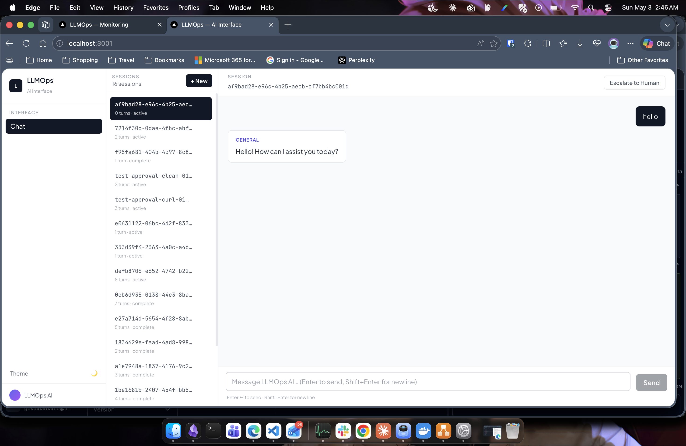

---

## RAG: Not Just Retrieval, But Evaluation

The `tools` node does more than search. When a query arrives:

1. It embeds the query using AWS Bedrock Titan Embed Text v2 (256 dimensions)
2. It performs cosine similarity search in Qdrant (top_k = 5)
3. It computes a **RAG score** — the max dot product between the query embedding and the retrieved document embeddings
4. If RAG score < 0.6, it re-retrieves with top_k doubled
5. If still < 0.6 after re-retrieval, it auto-flags the session for HITL review
6. The LangChain agent synthesizes a response using the retrieved chunks, with source snippets and scores returned to the UI

Every response in the chat interface shows which route was used — `GENERAL`, `TOOLS`, or `ESCALATED` — plus latency in milliseconds and token count.

**Implementation:**

- RAG tool: [`src/tools/rag.py`](../src/tools/rag.py) — `semantic_document_search` LangChain tool
- Qdrant service: [`src/services/qdrant.py`](../src/services/qdrant.py) — collection, upsert, semantic search
- Embedding service: [`src/services/embedding.py`](../src/services/embedding.py) — Titan Embed v2 with retry backoff
- Bedrock service: [`src/services/bedrock.py`](../src/services/bedrock.py) — converse, structured output, agent

---

## Evaluation Pipeline: Continuous Quality Monitoring

Demos skip this part. Production systems can't.

After every document ingest, a Lambda function (`eval_runner`) is invoked asynchronously. It runs each "golden query" — test questions you define in the dashboard — against the freshly updated Qdrant index and records three metrics per query:

### RAG evaluation metrics

| Metric       | Source                   | What it measures                            |
|--------------|--------------------------|---------------------------------------------|
| RAG score    | Cosine similarity in Qdrant | Quality of retrieval (right chunks?)     |
| Faithfulness | LLM-as-judge (Bedrock)   | Is the answer grounded in retrieved text?   |
| Relevance    | LLM-as-judge (Bedrock)   | Does the answer address the question?       |

These results appear in the RAG Evals dashboard, which refreshes every 15 seconds. You can add, edit, or delete golden queries from the UI — no code change, no redeployment.

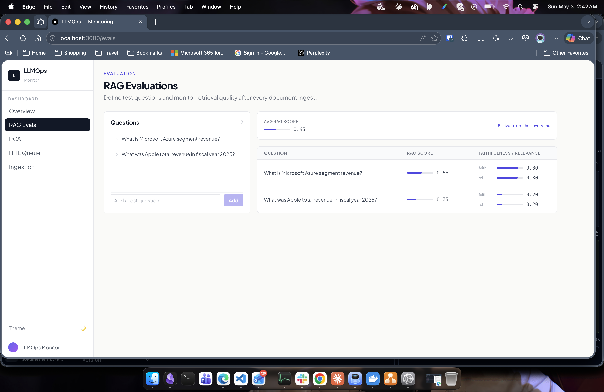

Separately, every 15 minutes, a second Lambda (`pca_runner`) scans for sessions that have been inactive for at least 15 minutes and runs a post-conversation analysis. It uses structured output from Bedrock to extract:

- **Topics** discussed
- **Sentiment** (positive / neutral / negative)
- **Unresolved questions** — things the customer asked that the AI couldn't answer

If negative sentiment reaches 60% or average unresolved questions per session reaches 3, the system raises a degradation alert and automatically creates a HITL item for review.

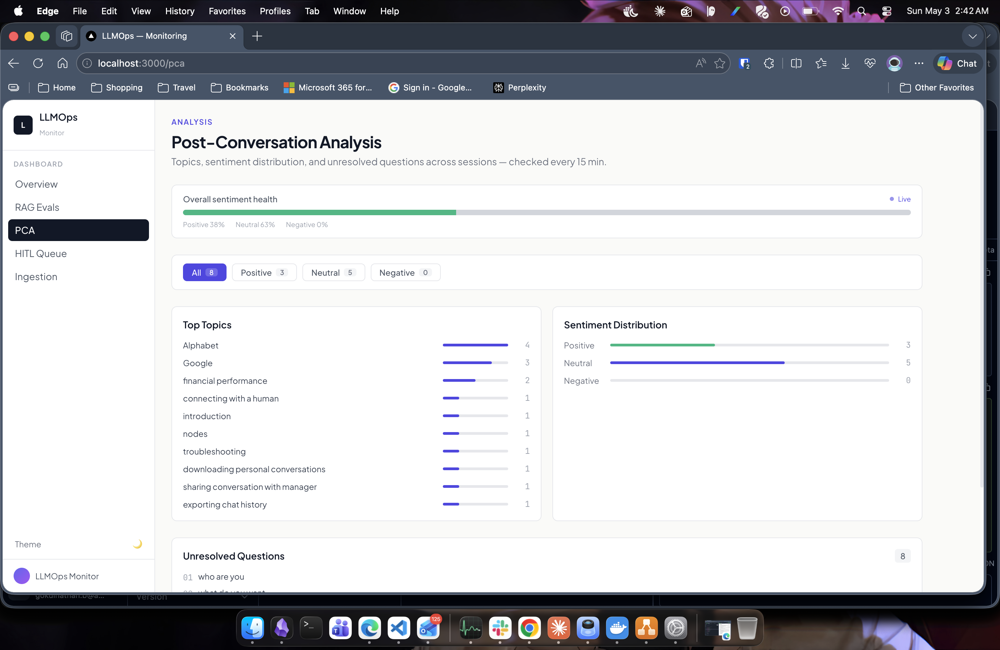
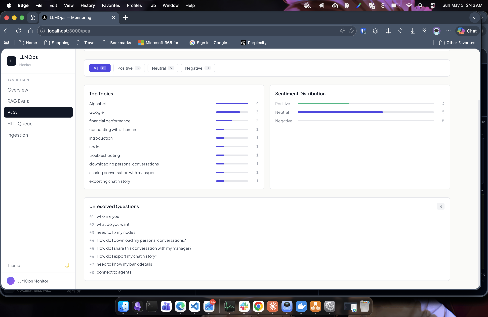

**Implementation:**

- RAG evaluator: [`evaluations/rag_evaluator.py`](../evaluations/rag_evaluator.py) — golden queries → cosine sim + LLM judge
- Eval runner: [`evaluations/eval_runner.py`](../evaluations/eval_runner.py) — Lambda entry point
- PCA runner: [`evaluations/pca.py`](../evaluations/pca.py) — post-conversation analysis
- Terraform (Lambdas + SQS + EventBridge): [`iac/stacks/evaluations/`](../iac/stacks/evaluations/)

---

## Human-in-the-Loop: Two Modes That Cover Real Production Scenarios

The HITL system handles two distinct situations:

### Mode 1: Escalation (mid-conversation handoff)

When a query is classified as `escalate` — or when the eval pipeline flags a session for low RAG quality — the session is marked `hitl_pending`. In the customer-facing AI interface:

- A blue banner appears: "Connected to a human agent — type below to reply."
- The input placeholder changes to "Reply to human agent..."
- All messages the customer types bypass the AI pipeline entirely

In the operator's HITL Queue dashboard, the session appears under "Pending" with its full conversation history. The operator can read the conversation, send responses (multi-turn), and when resolved, click "Resolve & Hand Back" — which sets the session back to `active` and re-enables AI processing.

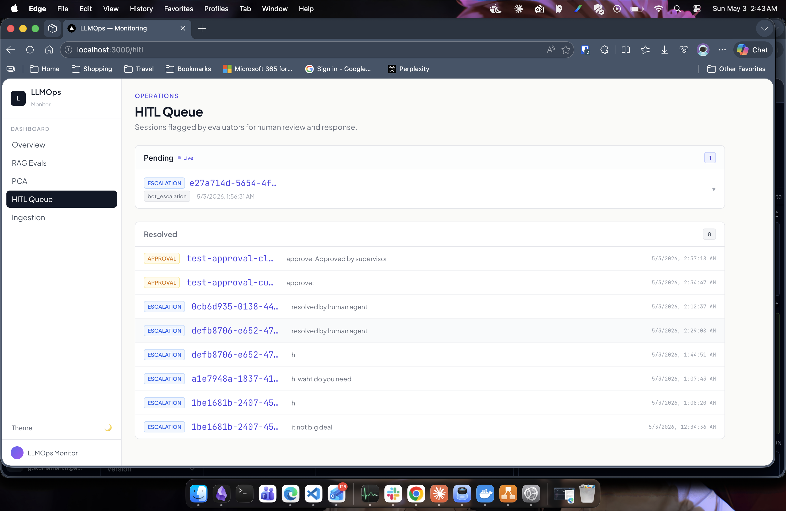
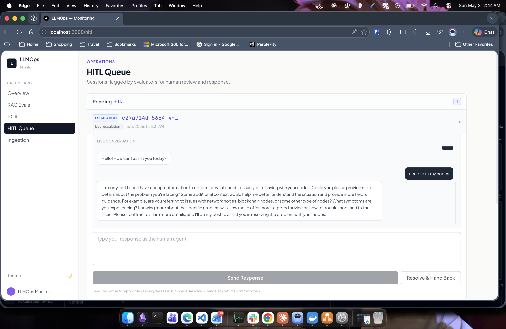

### Mode 2: Approval Gate (pre-action supervisor sign-off)

When a query is classified as `approval_required`, the session enters a different state. The customer sees an amber banner and the input is disabled. In the HITL Queue, the operator sees the action description, a risk badge (low / medium / high), and Approve / Reject buttons with an optional note field.

These two modes cover the two situations where human oversight matters most: when the AI is uncertain, and when the action is sensitive.

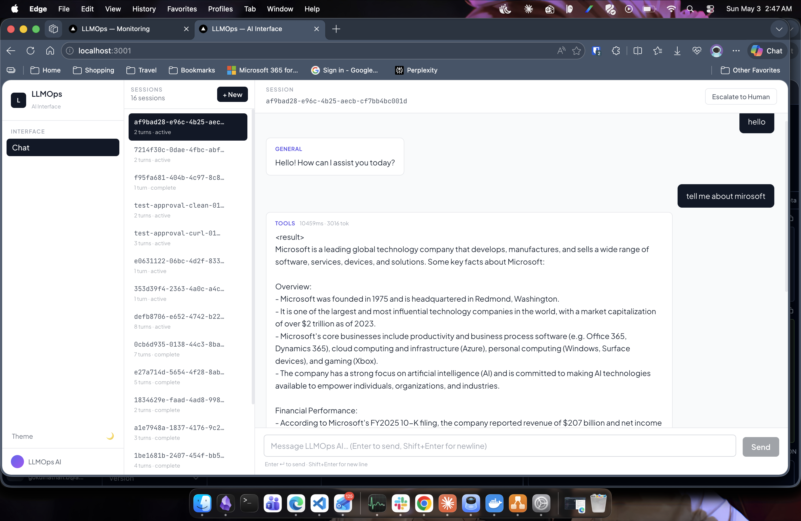
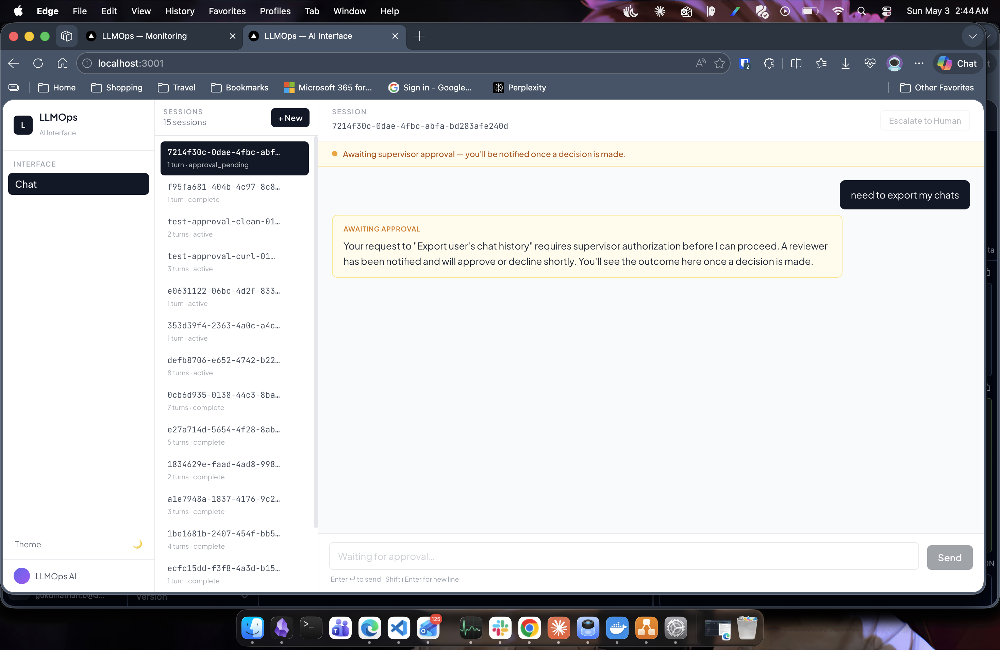
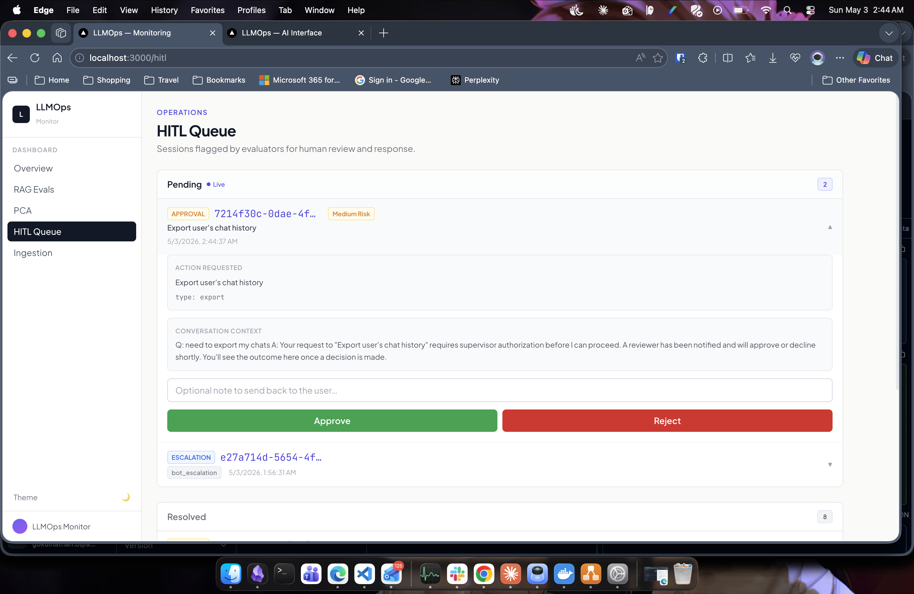
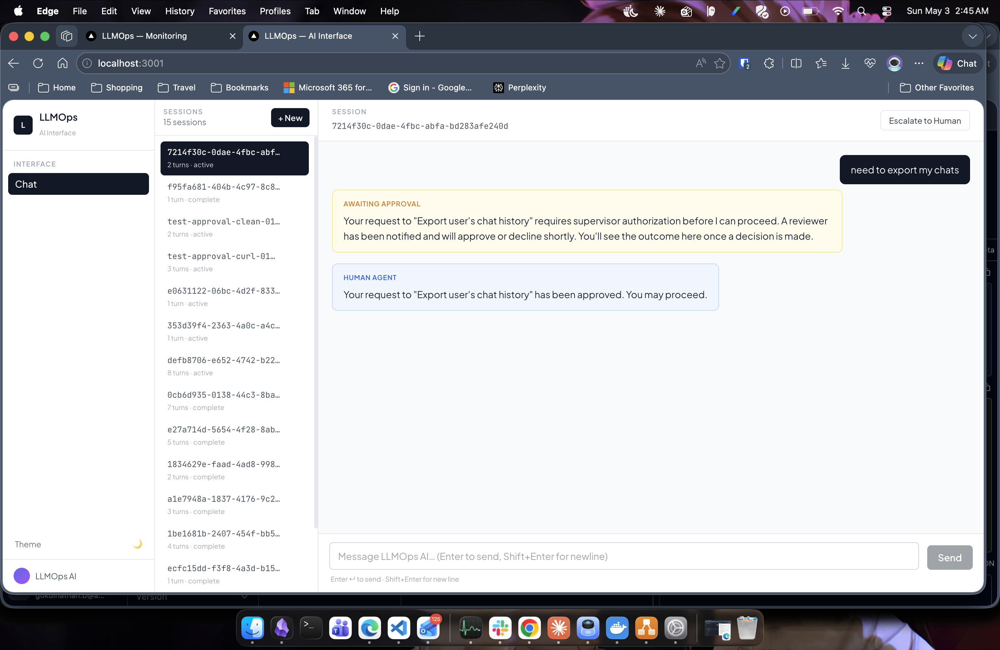
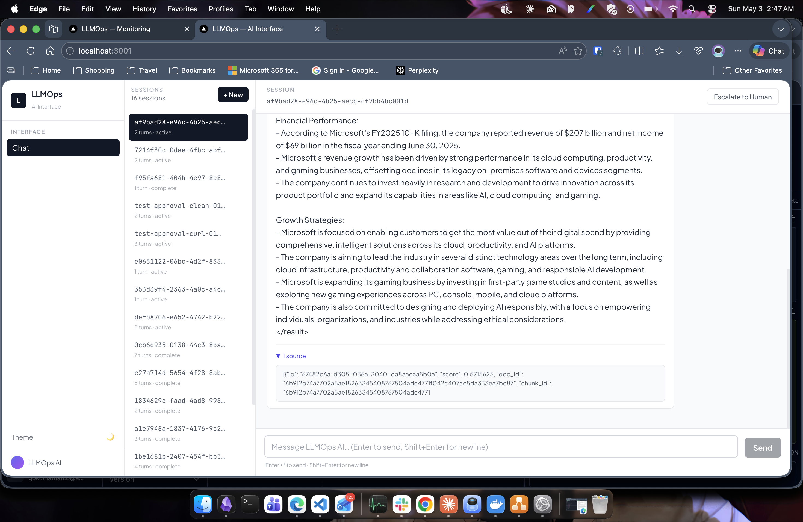

**Implementation:**

- HITL escalation node: [`src/nodes/hitl_escalate.py`](../src/nodes/hitl_escalate.py)
- Approval gate node: [`src/nodes/approval_gate.py`](../src/nodes/approval_gate.py)
- Conversation service (DynamoDB + HITL queue): [`src/services/conversation.py`](../src/services/conversation.py)
- Dashboard API routes: [`src/api/dashboard.py`](../src/api/dashboard.py) — `/api/hitl/*` endpoints
- HITL Queue UI: [`dashboard/realtime-monitoring/src/app/hitl/page.tsx`](../dashboard/realtime-monitoring/src/app/hitl/page.tsx)
- DynamoDB table: [`iac/stacks/data/`](../iac/stacks/data/)

---

## The Monitoring Dashboard

The realtime-monitoring Next.js app (port 3000) has five pages:

| Tab | Description |
|-----|-------------|
| **Overview** | KPI cards (avg RAG score, avg faithfulness, HITL pending, cost today), recent eval table |
| **RAG Evals** | Golden query list with add/edit/delete + latest evaluation results per query |
| **PCA** | Topic distribution, sentiment breakdown, unresolved questions list |
| **HITL Queue** | Pending escalation/approval items with live conversation thread + resolved history |
| **Ingestion** | Upload file or provide S3 key, live job status, ingested documents with cascade-delete |

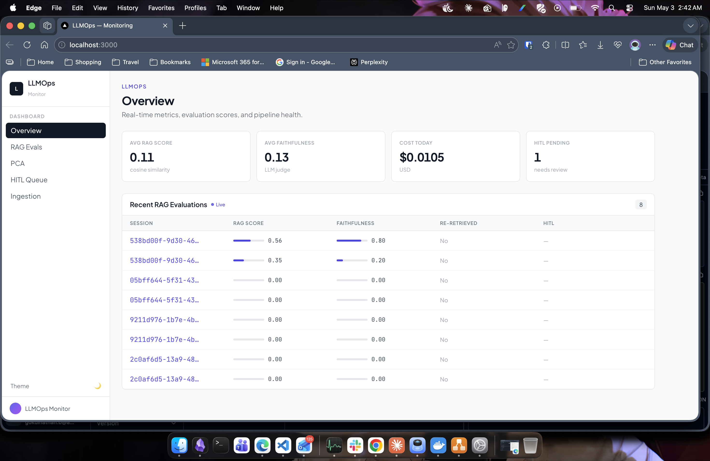
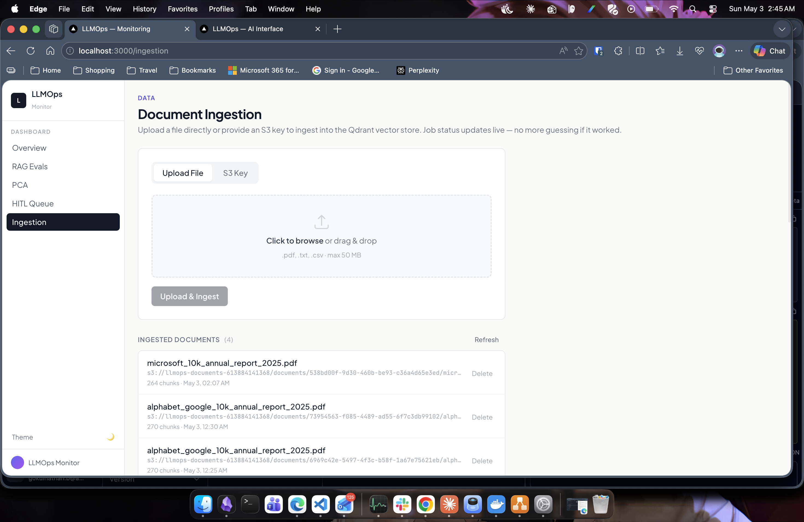
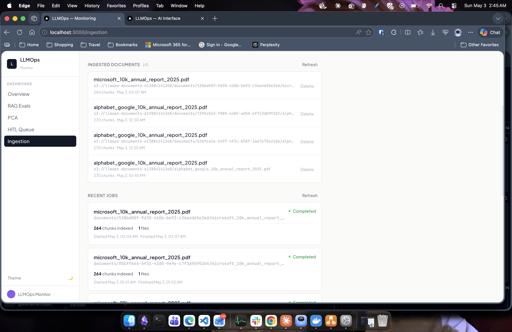

**Implementation:**

- Dashboard app: [`dashboard/realtime-monitoring/`](../dashboard/realtime-monitoring/)
- KPI cards: [`dashboard/realtime-monitoring/src/components/KpiCards.tsx`](../dashboard/realtime-monitoring/src/components/KpiCards.tsx)
- HITL Queue component: [`dashboard/realtime-monitoring/src/components/HitlQueue.tsx`](../dashboard/realtime-monitoring/src/components/HitlQueue.tsx)
- Ingestion panel: [`dashboard/realtime-monitoring/src/components/IngestionPanel.tsx`](../dashboard/realtime-monitoring/src/components/IngestionPanel.tsx)
- API client: [`dashboard/realtime-monitoring/src/lib/api.ts`](../dashboard/realtime-monitoring/src/lib/api.ts)
- CloudWatch Terraform: [`iac/stacks/monitoring/`](../iac/stacks/monitoring/)

---

## The AI Interface

The ai-interface Next.js app (port 3001) is the customer-facing side. It's a two-pane layout:

**Left sidebar** — Session list showing all conversations with turn count and status badge (active / complete / hitl_pending / approval_pending).

**Main pane** — The chat thread, with each AI response showing:
- A route badge (`GENERAL`, `TOOLS`, `ESCALATED`, or `APPROVAL REQUIRED`)
- Latency in milliseconds and token count
- For TOOLS responses: expandable source documents with text snippets and cosine scores

The interface adapts its state based on session status:
- `hitl_pending` → blue banner, "Reply to human agent…" placeholder, no AI invocation
- `approval_pending` → amber banner, input disabled
- `active` → normal input with "Message LLMOps AI…" placeholder

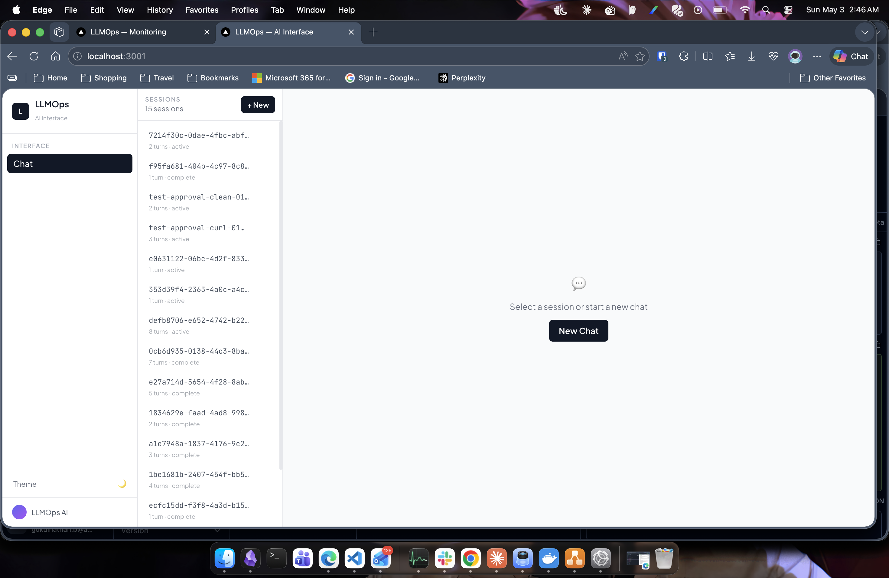

**Implementation:**

- Chat interface: [`dashboard/ai-interface/`](../dashboard/ai-interface/)
- Chat thread: [`dashboard/ai-interface/src/components/ChatThread.tsx`](../dashboard/ai-interface/src/components/ChatThread.tsx)
- Session list: [`dashboard/ai-interface/src/components/SessionList.tsx`](../dashboard/ai-interface/src/components/SessionList.tsx)
- API client: [`dashboard/ai-interface/src/lib/api.ts`](../dashboard/ai-interface/src/lib/api.ts)

---

## Observability: Langfuse All the Way Down

Every execution runs through Langfuse tracing. The graph invocation is the root span. Each node — intent, general, tools — is a child span. Inside the tools node, the LangChain agent's tool calls (the individual Qdrant searches) are captured as nested spans under the `@observe()` decorator.

Prompts are versioned in Langfuse (`intent_router`, `general_assistant`, `rag_assistant`) and fetched at startup. You can update a prompt in Langfuse and the next request picks up the new version — no redeployment required. If Langfuse is unreachable at startup, the system falls back to hardcoded prompts.

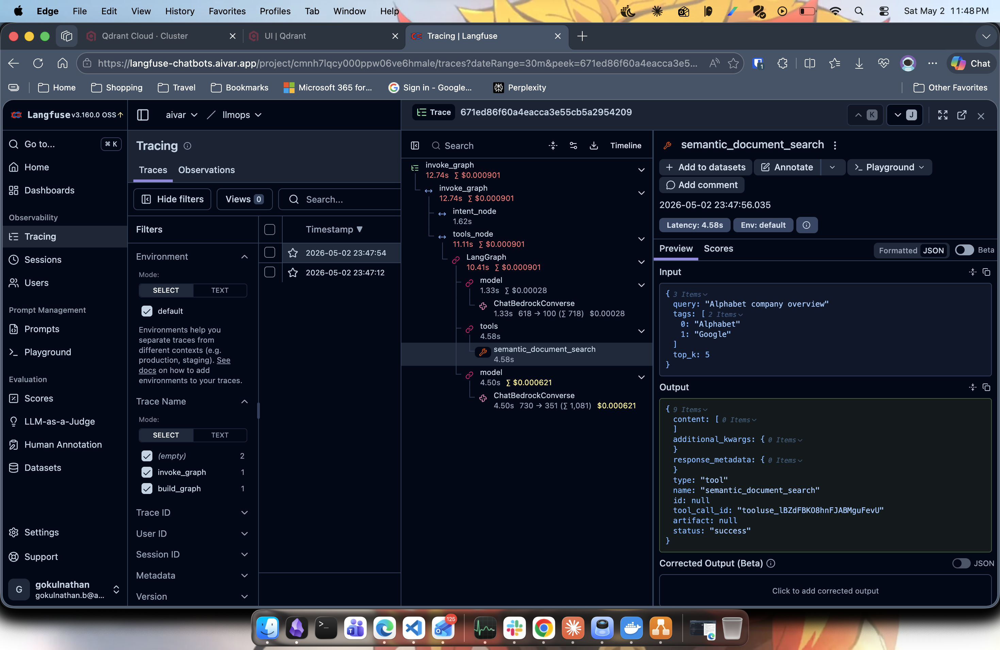

Per-turn cost is tracked in DynamoDB using Claude Haiku 4.5 pricing ($0.80/M input tokens, $4.00/M output tokens) and aggregated by the `/api/metrics/summary` endpoint into the "Cost Today" KPI.

**Implementation:**

- Prompt service: [`src/services/prompt.py`](../src/services/prompt.py) — Langfuse prompt versioning + fallbacks
- Settings: [`src/setting/config.py`](../src/setting/config.py) — `ENABLE_LANGFUSE` toggle

---

## Infrastructure: Five Terraform Stacks

The system is deployed as five independent Terraform stacks, each with its own state file:

| Stack | Path | Manages |
|-------|------|---------|
| `app` | [`iac/stacks/app/`](../iac/stacks/app/) | EC2 instance, ECR repository, IAM roles |
| `data` | [`iac/stacks/data/`](../iac/stacks/data/) | DynamoDB tables, S3 documents bucket |
| `evaluations` | [`iac/stacks/evaluations/`](../iac/stacks/evaluations/) | Lambda functions, SQS queue, EventBridge schedules |
| `monitoring` | [`iac/stacks/monitoring/`](../iac/stacks/monitoring/) | CloudWatch dashboard and alarms |
| `security` | [`iac/stacks/security/`](../iac/stacks/security/) | Secrets Manager |

Cross-stack dependencies are injected via tfvars — no workspace coupling, no shared state files. Each stack can be deployed or updated independently.

---

## What I Learned

**Structure your evals before you ship.** The golden query framework only works if you've thought about what "good" looks like before going to production. Add your test questions when you first set up the system, not after you notice it's wrong.

**HITL is not a fallback — it's a feature.** The most useful insight from building this is that the escalation path is part of the product. An AI that knows when to hand off is more trustworthy than one that confidently answers everything.

**Structured output changes everything.** Using JSON schema-constrained output for intent classification, LLM judging, and PCA extraction means you're working with typed data, not parsing free text. The reliability difference is significant.

**Observability at the node level, not just the request level.** Tracing the full LangGraph execution — including nested LangChain tool calls — gives you a completely different debugging experience than logging the final response.

---

## Limitations & Next Steps

- **Answer correctness evaluator** — The eval pipeline currently uses cosine similarity as the primary RAG score, which measures retrieval quality but not response quality end-to-end. Next: comparing generated answers against a ground truth set.
- **Team-based HITL routing** — The HITL system currently handles escalations one session at a time. At scale: routing logic so escalations go to the right team (financial questions to finance, technical to support), with SLA tracking and queue prioritization.
- **Streaming responses** — Currently responses are returned as a single payload. Adding SSE/WebSocket streaming would improve perceived latency.

---

## Contributing

See [`CONTRIBUTING.md`](../CONTRIBUTING.md) for:

- Development setup (Python 3.13, uv, Docker, AWS credentials)
- Testing guidelines with `pytest` and `moto`
- Code style enforced via Ruff
- Branch naming and Conventional Commit messages

To discuss the eval pipeline, the HITL architecture, or the LangGraph routing patterns — [open an issue](https://github.com/gokulnathan66/llmops/issues) or [start a discussion](https://github.com/gokulnathan66/llmops/discussions).

---

## License

MIT — see [`LICENSE`](../LICENSE).
